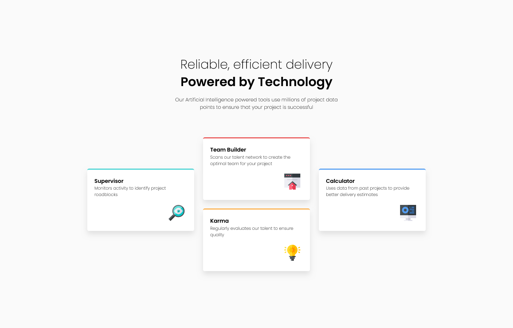

# My Solution to the Four Card Feature Section Project

## Desktop Design Screenshot

## Moblie Design Screenshot

## Links
- Solution URL: https://github.com/FHernandez08/four-card-feature-section-master
- Live Site URL: https://four-card-feature-section-master-tau-one.vercel.app/

## My Process
### Built with
- HTML
- CSS
- Grid

### What I learned 
From this project, I was able to gain more confidence with grid and how I can be able to move around grid items with using row and column. I was able to learn about moving stuff around by also using nth-child properties to assign the right location for each of the grid item.

### Continued Development
What I want to continue doing is to be efficient with both HTML and CSS to make sure that when I start creating projects with JavaScript, and in the future, React and Node.js, I want to be able to make these projects without much difficulty and confusion.

### Author
- Frontend Mentor: @FHernandez08